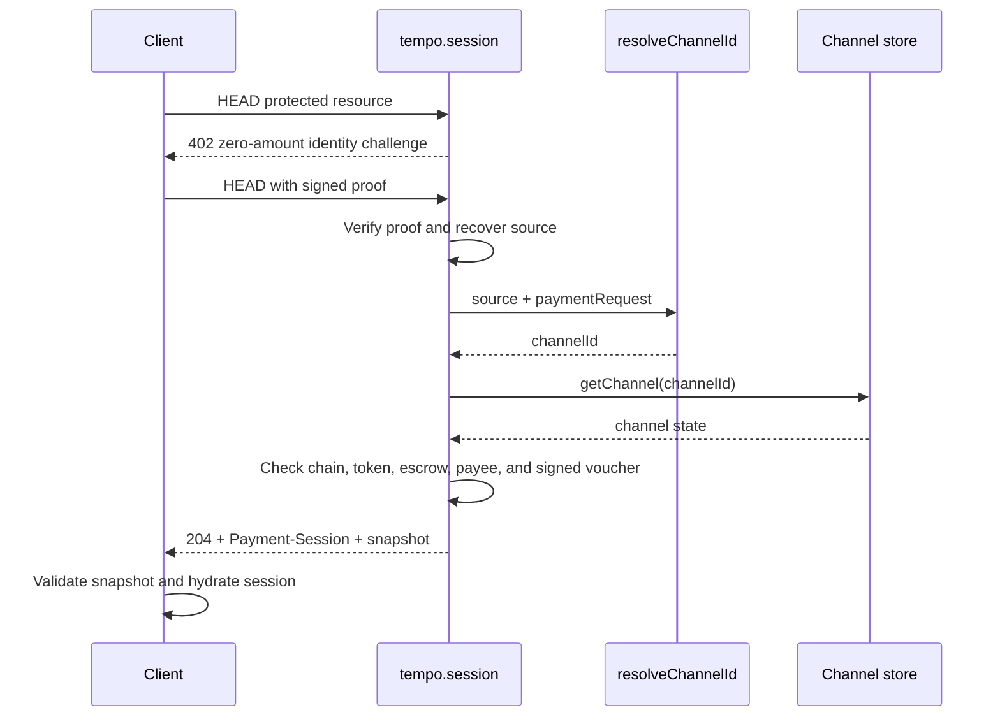

# Stream: Multiple Fetches

Multiple paid requests over a single payment channel, then close and settle. Demonstrates a batch scraping use case where each fetch increments the cumulative voucher by 0.01 pathUSD.

Each paid HTTP response carries a `Payment-Receipt` header. For session routes, the receipt's `spent` and `units` fields reflect channel state after that request, which is what standalone clients should use for follow-up close flows.

## Reusing a session after client restart

Enable `bootstrap` when a client should recover an existing channel before its
first paid request:

```ts
tempo.session({
  bootstrap: true,
  resolveChannelId({ source, paymentRequest }) {
    return db.findChannelId({
      payer: parseSource(source),
      payee: paymentRequest.recipient,
      token: paymentRequest.currency,
      // Include chain and escrow when the application supports more than one.
    })
  },
})
```

The bootstrap flow is:



`resolveChannelId` is the application-owned identity/scope lookup. The channel
store only loads state for a known `channelId`; MPPx does not scan the store or
define a secondary-index format. If the request already supplies a channel ID,
MPPx uses it without calling the hook. Before advertising a recovered channel,
MPPx checks that it is active, matches the requested chain, token, escrow, and
payee, and contains the signed highest voucher required for safe client
rehydration.

## Setup

```bash
npx gitpick wevm/mppx/examples/session/multi-fetch
pnpm i
```

## Usage

Start the server:

```bash
pnpm dev
```

In a separate terminal, run the client:

```bash
pnpm client
```

## Test with mppx CLI

With the server running, use the `mppx` CLI to make a paid request:

```bash
pnpm mppx localhost:5173/api/scrape
pnpm mppx localhost:5173/api/scrape?url=https://example.com
```
