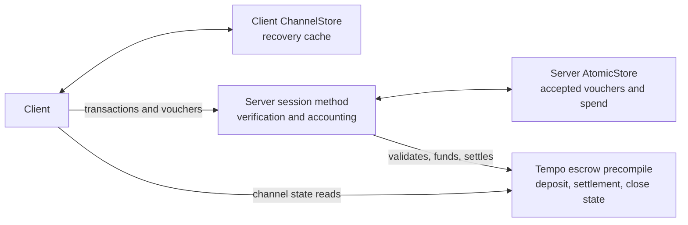
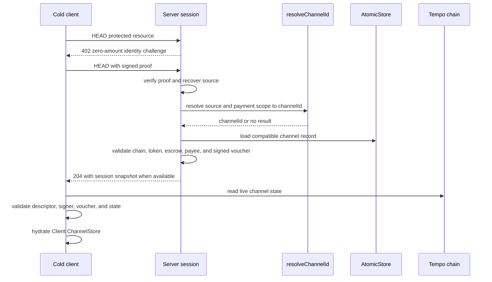

# Tempo Sessions design

Tempo Sessions implements TIP-1034 payment channels for repeated HTTP and
streaming payments. A session is a channel, not an application login session.

A payer authorizes a cumulative amount with a signed voucher. The server
accepts that authorization, records delivered spend, and settles on-chain under
server-owned policy.

## Design principles

1. A channel has distinct on-chain, server, and client state. No copy replaces
   another authority.
2. Vouchers authorize value; server accounting records delivered value; chain
   settlement captures value. These are separate operations.
3. The server atomically accepts vouchers and records charges. Multiple server
   instances share one linearizable channel store.
4. Client persistence and server snapshots accelerate recovery. Neither is
   proof of a reusable channel until cryptographic and chain validation pass.
5. Management credentials never invoke application content handlers.
6. Settlement policy belongs to the server. A client authorizes value but does
   not choose when it is settled.



## Authority model

| State                              | Meaning                                                                               | Authority                                                                           |
| ---------------------------------- | ------------------------------------------------------------------------------------- | ----------------------------------------------------------------------------------- |
| Channel descriptor and `channelId` | Immutable payer, payee, token, signer, operator, nonce, and salt identity.            | Derived from descriptor, chain ID, and escrow address. Every boundary validates it. |
| On-chain channel state             | Deposit, settled amount, and close state.                                             | Tempo escrow precompile.                                                            |
| Signed voucher                     | Payer authorization of a cumulative amount for one channel.                           | Client signer; server verifies before accepting.                                    |
| Server channel record              | Highest accepted signed voucher, delivered `spent`, `units`, and settlement progress. | Server `AtomicStore`.                                                               |
| Client channel entry               | Latest locally usable channel descriptor, deposit, and cumulative authorization.      | Client `ChannelStore`; a cache.                                                     |
| `SessionSnapshot`                  | Server-provided recovery hint.                                                        | Untrusted until client validation.                                                  |

## Escrow configuration and trust

The server owns escrow configuration. Its session method uses the canonical
TIP20EscrowChannel address by default. The method-level `escrowContract` applies
to all routes unless a route supplies its own value. The resolved address is
included in each session challenge so clients can construct transactions,
channel IDs, and voucher signatures for the same contract.

```ts
// Canonical escrow: no configuration required.
const canonicalSession = tempo.session({ account, currency, getClient, store })

// Custom deployment: the server advertises this address in its challenges.
const customSession = tempo.session({
  account,
  currency,
  escrowContract: customEscrow,
  getClient,
  store,
})

const customRoute = mppx.session({
  amount: '0.01',
  escrowContract: routeEscrow,
  unitType: 'request',
})
```

Receiving an address in a challenge does not make it trusted. Clients accept
only the canonical escrow by default. A challenge advertising any other address
is rejected before the client signs a transaction or voucher.

Clients that intentionally support a server's custom deployment opt in with
`allowCustomEscrow: true`:

```ts
import { tempo } from 'mppx/client'

// Default: allowCustomEscrow is false.
const canonicalOnly = tempo.session({ account })

// Trust the custom escrow address advertised by the server.
const customCompatible = tempo.session({
  account,
  allowCustomEscrow: true,
})

// The same option is available on the managed client.
const manager = tempo.session.manager({
  account,
  allowCustomEscrow: true,
})
```

`allowCustomEscrow` defaults to `false`; explicitly passing `false` has the same
behavior as omitting it. Setting it to `true` trusts the server-selected escrow
for a new channel. After resolution, persisted channel state remains bound to
that exact address, so a later challenge cannot switch an existing channel to a
different escrow.

The pre-existing client `escrow` option (or legacy `escrowContract`) remains an
exact-address pin for applications that need stronger policy. A pin takes
precedence over `allowCustomEscrow`: the advertised address must match it.

CLI clients use the same default and opt-in:

```bash
# Canonical escrow only (default)
mppx https://api.example.com/paid

# Accept the custom escrow advertised by this server
mppx https://api.example.com/paid -M allowCustomEscrow=true
```

This is a client trust decision. Servers do not set `allowCustomEscrow`, and
wallets or other clients may choose not to expose the opt-in at all.

The amounts below have intentionally different meanings.

| Amount                                        | Meaning                                      | Rule                                                     |
| --------------------------------------------- | -------------------------------------------- | -------------------------------------------------------- |
| `acceptedCumulative` / `highestVoucherAmount` | Highest voucher the server accepted.         | Never decreases.                                         |
| `spent`                                       | Value charged for content.                   | Never decreases; does not exceed accepted authorization. |
| `settled` / `settledOnChain`                  | Value captured by escrow.                    | Never decreases; chain-authoritative.                    |
| `requiredCumulative`                          | Authorization required for the next request. | It is a boundary, not a signed voucher.                  |

## Request lifecycle

The session method owns payment control flow. The route handler owns content.

```mermaid
sequenceDiagram
  participant C as Client
  participant S as Server session
  participant L as AtomicStore
  participant T as Tempo chain
  participant H as Route handler

  C->>S: protected request
  S-->>C: 402 session challenge
  C->>S: open or voucher credential
  S->>T: validate channel state; broadcast management transaction when needed
  S->>L: atomically accept voucher and record channel state
  S->>L: charge billable HTTP content
  S->>H: invoke only for a content credential
  H-->>C: response with Payment-Receipt
```

`open` and `voucher` credentials may pay for a billable request. `topUp` and
`close` are management credentials: they return `204` and never invoke the
route handler. `open` and `voucher` used on non-billable requests are also
management updates.

When `Fetch.from` creates an automatic `open`, it keeps the channel entry
provisional until the server accepts the response or acknowledges the open with
a matching receipt or session snapshot. Rejected or unacknowledged opens are
discarded so the next request retries `open`; concurrent automatic opens for the
same payment scope are serialized. Direct credential creation and
`SessionManager` retain their existing lifecycle ownership.

The current HTTP contract is deliberately pre-handler: voucher acceptance and
default request charging occur before the handler runs. A handler failure can
therefore follow an accepted voucher and recorded `spent`. Sessions does not
promise an atomic “charge only after a successful handler” transaction.

Applications with irreversible work define their own idempotency and failure
behavior. SDK changes must preserve this boundary or introduce an explicit
prepare/commit contract rather than changing it implicitly.

## Recovery lifecycle

The application owns durable mapping from its authenticated request identity to
a channel ID. The SDK owns channel lookup, snapshot construction, and recovery
validation.

`resolveChannelId` is the only application-defined recovery boundary. It maps a
verified request identity to an existing channel ID. It does not authorize a
channel, recreate accounting, or trust a client-provided channel ID.

### Bootstrap configuration

Enable `bootstrap` when a client should recover an existing channel before its
first paid request:

```ts
tempo.session({
  bootstrap: true,
  resolveChannelId({ source, paymentRequest }) {
    return db.findChannelId({
      payer: parseSource(source),
      payee: paymentRequest.recipient,
      token: paymentRequest.currency,
      // Include chain and escrow when the application supports more than one.
    })
  },
})
```

The hook resolves application identity and payment scope. The channel store
loads the returned primary key only; MPPx does not scan the store or define a
secondary-index format. If the request supplies a channel ID, MPPx uses it and
does not call the hook.



A snapshot is never authorization. Before caching it, the client validates the
descriptor-derived ID, payer, authorized signer, signed voucher when present,
and live on-chain state. A snapshot that lacks a usable signed voucher cannot
create higher client authorization; the client reuses persisted state or opens
a channel instead.

## Streaming lifecycle

SSE and WebSocket are stream-metered. They do not reuse normal HTTP response
accounting. The server emits a voucher boundary as content is consumed; the
client submits the next signed cumulative voucher; the server accepts it and
emits a receipt before content continues.

```mermaid
sequenceDiagram
  participant S as Metered server stream
  participant C as Client transport driver
  participant L as AtomicStore

  S->>C: content
  S->>C: need-voucher(requiredCumulative)
  C->>C: enforce max deposit; top up when required
  C->>S: signed voucher
  S->>L: atomically accept voucher
  S->>C: receipt
  S->>C: continue content
```

The initial SSE POST is excluded from default HTTP charging to prevent double
counting. Stream accounting remains owned by the transport driver.

## Server transport configuration

A session method owns the account, channel store, verification policy, and
settlement schedule. Routes add prices and application content. HTTP and SSE
run through configured route handlers; WebSocket uses a session-bound helper
because its application messages no longer pass through HTTP.

| Server shape           | Session option | Content API                         | Charging                            |
| ---------------------- | -------------- | ----------------------------------- | ----------------------------------- |
| HTTP only              | Omit `sse`     | `result.withReceipt(Response)`      | Once per billable request           |
| SSE only               | `sse: true`    | `result.withReceipt(AsyncIterable)` | Each `stream.charge()`              |
| WebSocket only         | Omit `sse`     | `mppx.session.serveWebSocket(...)`  | Each `stream.charge()`              |
| HTTP + SSE + WebSocket | `sse: true`    | All three APIs                      | Selected by route and response type |

All transports for one session service must share the same configured session
method and store. `serveWebSocket` is bound to both the store and settlement
policy, so callers pass neither dependency again. `tempo.Ws.serve` remains the
low-level adapter for custom integrations.

### Shared method configuration

```ts
const session = tempo.session({
  account,
  currency,
  getClient: () => client,
  settlementSchedule: { units: 100 },
  store,
  // Include when this instance serves any SSE route.
  sse: true,
})

const mppx = Mppx.create({ methods: [session], secretKey })
```

`sse: true` enables async-iterable responses without changing ordinary
`Response` handling, so a mixed server uses one session method.

### HTTP

```ts
const httpRoute = mppx.session({ amount: '0.01', unitType: 'request' })
const result = await httpRoute(request)

if (result.status === 402) return result.challenge
return result.withReceipt(Response.json({ ok: true }))
```

HTTP accounting charges the configured route amount before application content
runs. A plain `Response` selects normal HTTP handling even when `sse: true`.

### SSE

```ts
const sseRoute = mppx.session({ amount: '0.001', unitType: 'token' })
const result = await sseRoute(request)

if (result.status === 402) return result.challenge
return result.withReceipt(async function* (stream) {
  for await (const token of generateTokens()) {
    await stream.charge()
    yield token
  }
})
```

SSE requires `sse: true` on the shared session method. The async iterable
selects SSE framing and transport-owned metering.

### WebSocket

```ts
const wsRoute = mppx.session({ amount: '0.001', unitType: 'token' })

webSocketServer.on('connection', (socket, request) => {
  void mppx.session.serveWebSocket({
    generate: async function* (stream) {
      for await (const token of generateTokens()) {
        await stream.charge()
        yield token
      }
    },
    route: wsRoute,
    socket,
    url: new URL(request.url!, `ws://${request.headers.host}`),
  })
})
```

The application still exposes `wsRoute` over HTTP for the initial challenge
probe. The bound helper reuses the session store and automatic settlement
schedule for in-band WebSocket vouchers and charges.

### Mixed server

```ts
const httpRoute = mppx.session({ amount: '0.01', unitType: 'request' })
const sseRoute = mppx.session({ amount: '0.001', unitType: 'token' })
const wsRoute = mppx.session({ amount: '0.001', unitType: 'token' })

async function handler(request: Request) {
  const pathname = new URL(request.url).pathname
  if (pathname === '/api/data') return serveHttp(httpRoute, request)
  if (pathname === '/api/events') return serveSse(sseRoute, request)
  if (pathname === '/ws') return serveWebSocketProbe(wsRoute, request)
  return new Response('Not found', { status: 404 })
}
```

Each route can choose its own price and unit type. Verification, channel state,
and settlement policy remain shared through the single session method.

## Extension boundaries

| Change                         | Preserve                                                                                        |
| ------------------------------ | ----------------------------------------------------------------------------------------------- |
| Credential action or payload   | Descriptor validation, source binding, action gate, receipt semantics, and atomic store update. |
| Voucher or accounting rule     | Monotonic accepted/spent/settled values and linearizable updates.                               |
| Client planning or persistence | Channel scope key, recovery validation, max-deposit enforcement, and manual context behavior.   |
| Bootstrap or snapshot          | `resolveChannelId` ownership and client-side validation before cache hydration.                 |
| SSE or WebSocket transport     | Transport-owned metering and receipt coordination; no HTTP double charge.                       |

The module boundaries implement these contracts:

| Module                                                          | Responsibility                                                                |
| --------------------------------------------------------------- | ----------------------------------------------------------------------------- |
| `precompile/`                                                   | Channel identity, chain calls, vouchers, and wire primitives.                 |
| `client/CredentialState.ts` and `client/ChannelOps.ts`          | Credential planning, recovery validation, and client cache updates.           |
| `server/CredentialVerification.ts` and `server/ChannelStore.ts` | Credential verification and authoritative atomic channel state.               |
| `server/Settlement.ts`                                          | Content accounting and server-owned settlement cadence.                       |
| `server/RequestState.ts`                                        | Challenge context, bootstrap identity lookup, snapshots, and response gating. |
| `client/Transports.ts` and `server/Transports.ts`               | SSE and WebSocket payment control messages.                                   |
